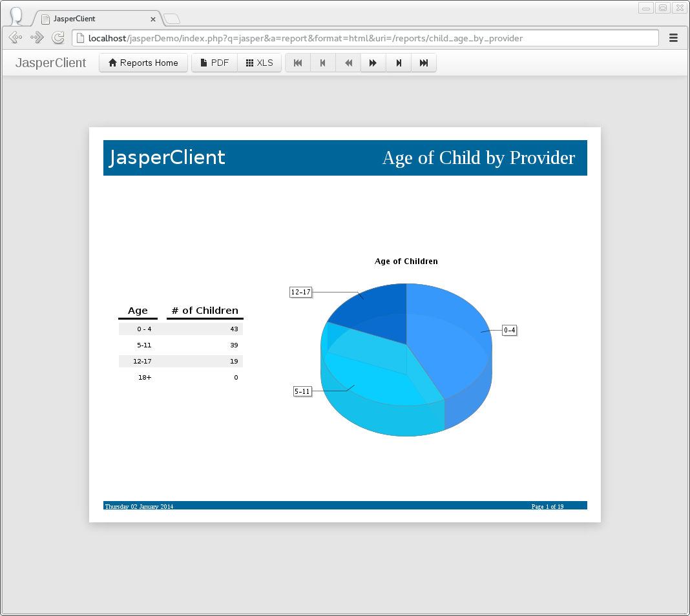

###JasperClient
--

####About
JasperClient is a php library for connecting to a Jaspersoft Report Server,
via REST API, to run reports.

The core goal of this library is to provide native Jasper report running within
a php application. Creating, updating, and deleting reports or other objects
in the Jaspersoft Report Server is not planned at this time.

This repo includes a php demo report viewer that will display your existing
reports and takes very little effort to set up.  You can use the demo report
viewer as an example of how to integrate the JasperClient into your application
or you can simply embed the viewer in your php application as is.
 
This library contains some modified code from the flowl/jasper library available at:
https://github.com/flowl/jasper

The flowl/jasper library was in beta and missing functionality that we needed
(Oct 2013). We originally planned to create a pull request against the library,
but ended up changing it too heavily and deleted a lot of code that we didn't
need.

####Features
* Minimal configuration
* Sample report viewer with pagination and export to pdf/xls
* Supports capability to override input controls
* Supports caching of folder and report metadata

####Example

####Status
Beta - Jan 2014

####Issues to Resolve
* Clean-up report viewer code
* Find better way to handle report page count
* Cleanup error handling in the report viewer
* Add support for jasper professional server
* Add support for more than one folder level in viewer
* Fix issue where reports can display in folder view
